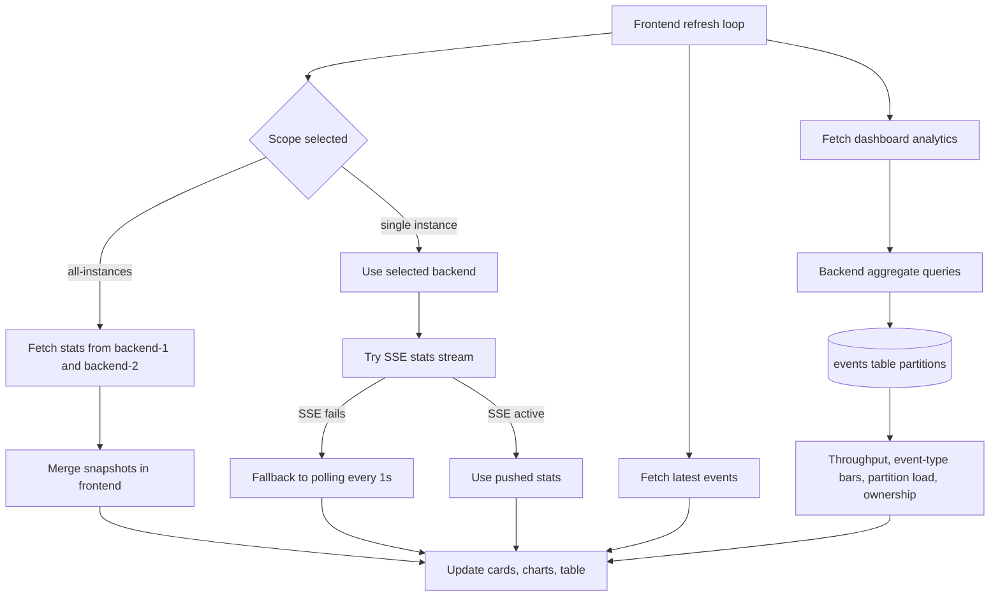

```mermaid
flowchart TD
  A[Frontend refresh loop] --> B{Scope selected}
  B -->|all-instances| C[Fetch stats from backend-1 and backend-2]
  B -->|single instance| D[Use selected backend]

  C --> E[Merge snapshots in frontend]
  D --> F[Try SSE stats stream]
  F -->|SSE fails| G[Fallback to polling every 1s]
  F -->|SSE active| H[Use pushed stats]

  A --> I[Fetch latest events]
  A --> J[Fetch dashboard analytics]

  J --> K[Backend aggregate queries]
  K --> L[(events table partitions)]
  L --> M[Throughput, event-type bars, partition load, ownership]

  E --> N[Update cards, charts, table]
  G --> N
  H --> N
  I --> N
  M --> N
```