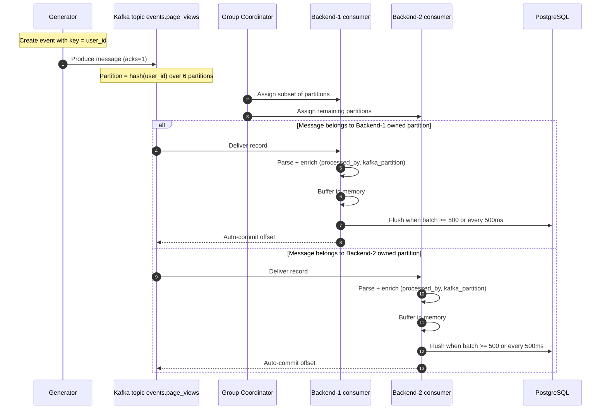

# Kafka Lifecycle

```mermaid
sequenceDiagram
  autonumber
  participant G as Generator
  participant K as Kafka topic events.page_views
  participant C as Group Coordinator
  participant B1 as Backend-1 consumer
  participant B2 as Backend-2 consumer
  participant DB as PostgreSQL

  Note over G: Create event with key = user_id
  G->>K: Produce message (acks=1)

  Note over K: Partition = hash(user_id) over 6 partitions

  C->>B1: Assign subset of partitions
  C->>B2: Assign remaining partitions

  alt Message belongs to Backend-1 owned partition
    K->>B1: Deliver record
    B1->>B1: Parse + enrich (processed_by, kafka_partition)
    B1->>B1: Buffer in memory
    B1->>DB: Flush when batch >= 500 or every 500ms
    B1-->>K: Auto-commit offset
  else Message belongs to Backend-2 owned partition
    K->>B2: Deliver record
    B2->>B2: Parse + enrich (processed_by, kafka_partition)
    B2->>B2: Buffer in memory
    B2->>DB: Flush when batch >= 500 or every 500ms
    B2-->>K: Auto-commit offset
  end
```