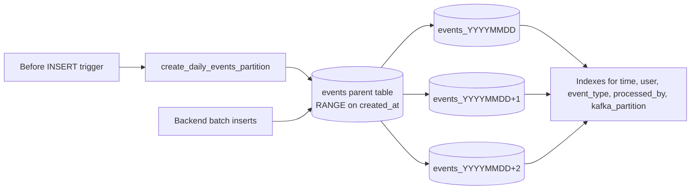

# PostgreSQL Partitioning Model

```mermaid
flowchart LR
  T[Before INSERT trigger] --> F[create_daily_events_partition]
  F --> E[(events parent table<br/>RANGE on created_at)]

  E --> P1[(events_YYYYMMDD)]
  E --> P2[(events_YYYYMMDD+1)]
  E --> P3[(events_YYYYMMDD+2)]

  N[Backend batch inserts] --> E
  P1 --> Q[Indexes for time, user, event_type, processed_by, kafka_partition]
  P2 --> Q
  P3 --> Q
```